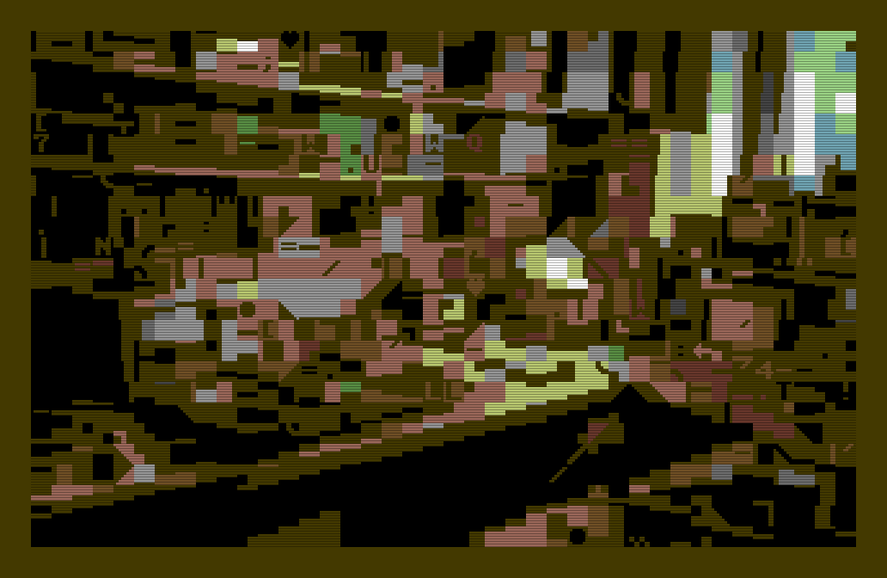
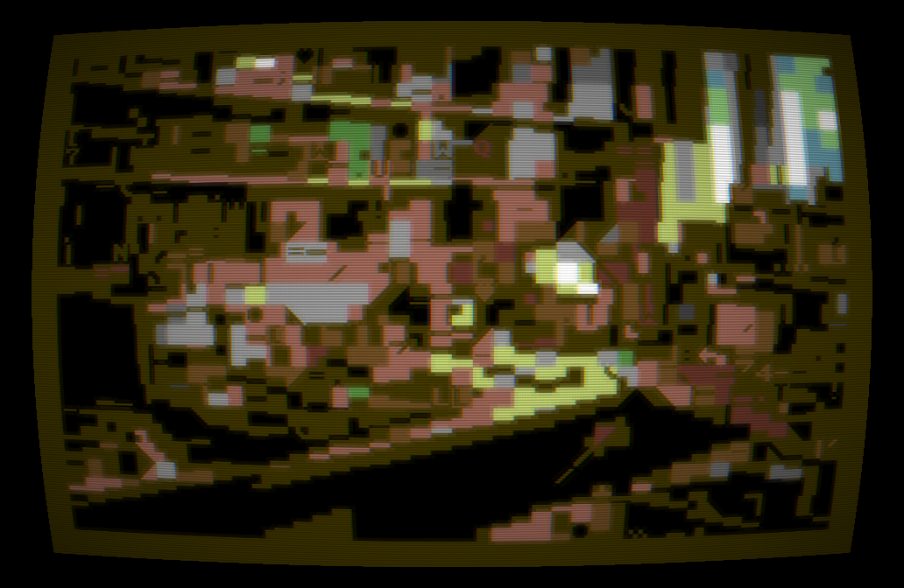

# ComfyUI-PETSCII

Convert images and video to C64 PETSCII inside ComfyUI. Optimal glyph and colour
matching in Oklab, with temporal hysteresis so video does not boil frame to frame.



Every cell picks the screen code and foreground colour that minimise squared Oklab
error against the source, over all 256 codes and 16 colours, with the background
chosen by a full 16-candidate search. Output is C64-true: real screen codes, 1000
cells, one global background.

## Install

Drop the folder into `ComfyUI/custom_nodes/`, or install from the registry. The only
dependency is numpy.

```sh
cd ComfyUI/custom_nodes
git clone https://github.com/purzbeats/ComfyUI-Petscii
```

Then restart ComfyUI. The nodes appear under `image/petscii`.

## Nodes

| Node | In → Out | |
|---|---|---|
| **PETSCII Convert** | IMAGE → IMAGE, PETSCII | Every engine knob as a widget. A batch is converted as independent stills. |
| **PETSCII Video Convert** | IMAGE batch → IMAGE, PETSCII | Temporal hysteresis across the batch, background voted once then locked. |
| **PETSCII Render** | PETSCII → IMAGE | Integer scale, border, and the CRT treatment. Re-render without reconverting. |
| **PETSCII Set Border** | PETSCII → PETSCII | Retints the border. Free — the border never enters the error math. |
| **PETSCII Info** | PETSCII → STRING | Frame count, background, glyph histogram, and how much moves between frames. |
| **PETSCII Load .petv** | file → PETSCII | Reads a stream back in, deltas applied. |
| **PETSCII Save .petv** | PETSCII → path | Writes the cell stream (core-spec §8.1). |

`PETSCII` is a custom datatype carrying the cells themselves, so `Render`, `Set
Border` and `Save .petv` never pay for the conversion twice — and `Load .petv`
means a stream recorded in the web app can be re-rendered at any scale, given the
CRT treatment, or exported as frames without ever being reconverted.

Both convert nodes report progress per frame and stop when you hit interrupt, and
`preview_frames` caps how many frames go to the node preview — every previewed
frame is a PNG written to disk, so an uncapped preview of a long clip costs more
than the conversion did.

### The CRT



Tick `crt` on the Render node for scanlines, an aperture grille, barrel
distortion, phosphor glow, vignette and chroma bleed — the same treatment, in the
same order and with the same constants, as the live app's post shader, so a still
from here and a frame from there look like the same monitor.

Every effect size is expressed in *native* screen pixels and scaled by the render
scale, so the look holds at 1x and at 8x rather than shrinking as you render
larger. Scanlines need `scale` of 3 or more to have room to show. Setting every
intensity to zero is a true bypass — the image is returned untouched.

### The two knobs that matter most

**`subset`** restricts the glyph vocabulary and is the biggest stylistic lever —
`blocks` gives a chunky mosaic, `dither` an even tonal ramp, `lines` a wireframe,
`text` renders the whole image in letterforms.

**`eps`** (Video Convert) is the temporal hysteresis threshold. A cell keeps its
previous choice unless a new one is better by more than `eps × 64`, which is what
stops the picture boiling frame to frame. `0` disables it; `0.002`–`0.008` is the
useful range.

## Example workflows

All three are in `workflows/`. The first two were executed end to end against a
live ComfyUI 0.33.0; the third is new and has been checked against the node
schemas but not yet run against a live server:

- **`image-to-petscii.json`** — Load Image → Convert → Render → Save Image.
- **`batch-to-petv.json`** — two Load Images → Batch Images → Video Convert →
  Save `.petv` + Save Image.
- **`petv-to-crt.json`** — Load `.petv` → Set Border → Render with the CRT → Save
  Image, with Info reporting on the stream. Nothing reconverts.

`example_inputs/` holds the two images the first two workflows expect; copy them
into `ComfyUI/input/`, along with a `.petv` for the third. In real use you would
feed Video Convert the frames of an actual clip, or the output of a sampler.

## `.petv`

The interchange format (core-spec §8.1): keyframes and deltas, true screen codes,
one global background. The VJ app plays back what these nodes write, and the
deferred C64 and Looking Glass exporters will read the same files.

`dt_ms` is whole milliseconds and most frame rates are not — 30 fps is 33.333 ms.
The writer emits differences between rounded timestamps rather than a rounded
interval, so 30 fps goes 33, 33, 34 and a clip of any length stays within half a
millisecond of true time instead of running one percent fast.

Interop is not assumed — `fixtures/interop.petv` was written by the independent
TypeScript implementation and is read back byte-for-byte by
`tests/test_interop.py`, which is what proves the two agree on the format rather
than merely on the prose describing it.

## Development

```sh
uv venv && uv pip install -e ".[dev]"
pytest -q          # 189 tests, ~7s
uvx ruff check .   # ruff is configured but not a dev dependency
```

The engine (`src/petscii_core/`) imports neither ComfyUI nor torch, which is why
the parity suite runs anywhere. `src/nodes.py` is the only file that touches
tensors, and it does nothing but convert at the boundary.

That boundary is tested too. `torch` is a dev-only dependency for it, and
`tests/conftest.py` stands in a thin `comfy_api` when a real one is absent, so
`tests/test_nodes.py` covers the widget parsing, the tensor round trip and the
schemas without needing a ComfyUI checkout — and skips cleanly without torch. If
you do have one, point `PYTHONPATH` at it and the same tests run against the real
v3 API.

`shared/` is the single source of truth for the palette, charset and subsets;
`sync_shared.py` mirrors it into the package so it ships in the wheel, and
`tests/test_data.py` fails if the two drift.

### Parity

The normative algorithm is [`core-spec.md`](core-spec.md). This port must reproduce the fixtures
frozen by the reference implementation, judged by the §7 comparator:

```
gradient  1000/1000 pixel-identical (100.00%; 941 exact, 59 same-render), 0 divergent
photo     1000/1000 pixel-identical (100.00%; 974 exact, 26 same-render), 0 divergent
portrait  1000/1000 pixel-identical (100.00%; 988 exact, 12 same-render), 0 divergent
noise     1000/1000 pixel-identical (100.00%; 1000 exact, 0 same-render), 0 divergent
ui         999/1000 pixel-identical ( 99.90%; 706 exact, 293 same-render), 0 divergent
```

"Same-render" is not a fudge. Wherever a cell's foreground equals the background,
every glyph paints solid background, so which one the argmin lands on is decided by
float noise and means nothing — the `ui` fixture is 30% such cells. What the
comparator holds the ports to is the picture.

`fixtures/` holds five 320x200 inputs and their frozen expected output. If parity
ever breaks, fix the spec first, then the engine, then regenerate the fixtures —
never adjust a fixture to match a change in behaviour.

## Credits

Charset rasterized from **Pet Me 64** by [Kreative
Software](https://www.kreativekorp.com/software/fonts/c64/). Palette is Pepto's.
Oklab is Björn Ottosson's. No Commodore ROM data ships here.
